# SISOP-1-2026-IT-023

# NAMA
Barra Ahza Fakhrullah 5027251023

# LAPORAN
## SOAL 1

Langkah pertama sebelum mengerjakan semua sub-soal adalah menyiapkan blok BEGIN untuk menginisialisasi field separator dan membaca argumen mode dari ARGV[2]. ARGV[2] kemudian dihapus menggunakan delete agar AWK tidak mencoba membuka argumen tersebut sebagai file.
``` awk
BEGIN { FS=","; mode=ARGV[2]; delete ARGV[2] }
```
Setelah itu, karena baris pertama file passenger.csv adalah header (Nama Penumpang, Usia, Kursi Kelas, Gerbong), maka baris pertama perlu di-skip menggunakan NR==1 { next } agar tidak ikut dihitung
``` awk
NR == 1 { next }
```
`a. Total Penumpang`

Untuk menghitung total penumpang, setiap kali AWK membaca satu baris data, variabel count ditambah 1. Karena header sudah di-skip, maka setiap baris yang dibaca pasti merupakan data penumpang. Di blok END, jika mode adalah 'a' maka nilai count langsung dicetak sebagai output.
``` awk
{ count++ }
END {
    if (mode == "a") {
        print "Jumlah seluruh penumpang KANJ adalah " count " orang"
    }
}
```
`b. Jumlah Gerbong Unik`

Untuk menghitung gerbong unik, digunakan array associatif AWK. Setiap baris data, kolom keempat ($4) yang berisi nama gerbong dijadikan sebagai index array dengan nilai 1. Karena array associatif AWK otomatis mengabaikan duplikat (index yang sama hanya disimpan sekali), maka di blok END cukup menggunakan fungsi length() untuk mengetahui berapa banyak gerbong unik yang ada.
``` awk
{ gerbong[$4] = 1 }

END {
    else if (mode == "b") {
        print "Jumlah gerbong penumpang KANJ adalah " length(gerbong)
    }
}
```
`c. Penumpang Tertua`

Untuk menemukan penumpang tertua, setiap baris data dibandingkan nilai kolom kedua ($2) yang berisi usia dengan nilai max_age yang disimpan sementara. Jika usia pada baris saat ini lebih besar dari max_age, maka max_age diperbarui dan nama penumpang ($1) disimpan ke variabel oldest. Proses ini berjalan terus hingga semua baris selesai dibaca, sehingga di blok END variabel oldest sudah pasti berisi nama penumpang dengan usia tertinggi.
``` awk
{
    if ($2 > max_age) {
        max_age = $2
        oldest = $1
    }
}

END {
    else if (mode == "c") {
        print oldest " adalah penumpang kereta tertua dengan usia " max_age " tahun"
    }
}
```
`d. Rata-rata Usia`

Untuk menghitung rata-rata usia, setiap baris data dijumlahkan nilai kolom kedua ($2) ke dalam variabel total_age. Di blok END, total_age dibagi dengan count untuk mendapatkan rata-rata. Karena soal meminta hasil tanpa angka di belakang koma, digunakan fungsi int() untuk membulatkan hasil pembagian tersebut sebelum dicetak.
``` awk
{ total_age += $2 }

END {
    else if (mode == "d") {
        avg = int(total_age / count)
        print "Rata-rata usia penumpang adalah " avg " tahun"
    }
}
```
`e. Penumpang Business Class`

Untuk menghitung jumlah penumpang Business Class, setiap baris data dicek nilai kolom ketiga ($3) yang berisi kelas kursi. Jika nilainya adalah 'Business', maka variabel business ditambah 1. Di blok END, jika mode adalah 'e' maka nilai business langsung dicetak sebagai output.
``` awk
{ if ($3 == "Business") business++ }

END {
    else if (mode == "e") {
        print "Jumlah penumpang business class ada " business " orang"
    }
}
```
`f. Invalid Option`

Untuk menangani kasus di mana user memasukkan argumen selain a, b, c, d, atau e, blok END menggunakan else di paling akhir sebagai fallback. Jika mode tidak cocok dengan satupun kondisi sebelumnya, maka akan dicetak pesan error beserta contoh penggunaan yang benar agar user mengetahui cara pemakaian script yang tepat.
``` awk
END {
    else {
        print "Soal tidak dikenali. Gunakan a, b, c, d, atau e."
        print "Contoh penggunaan: awk -f KANJ.sh data.csv a"
    }
}
```
**OUTPUT SOAL 1**

`a. Total Penumpang`


`b. Jumlah Gerbong Unik`


`c. Penumpang Tertua`


`d. Rata-rata Usia`


`e. Penumpang Business Class`


`f. Invalid Option`


**KENDALA**

tidak ada kendala

## SOAL 2

Langkah pertama adalah membuat virtual environment (venv) Python agar instalasi package terisolasi dan tidak mempengaruhi sistem. Venv dibuat di luar folder repo agar tidak ikut ter-push ke GitHub

`1a. Install gdown dan Download PDF`

Setelah venv aktif, diinstall gdown yaitu tools Python yang memungkinkan download file dari Google Drive lewat terminal. Setelah gdown terinstall, dibuat folder ekspedisi dan file PDF peta diunduh ke dalamnya.
```bash
# Buat virtual environment di luar repo
python3 -m venv ~/sisop-venv

# Aktifkan venv
source ~/sisop-venv/bin/activate

# Install gdown di dalam venv
pip install gdown

# Verifikasi gdown jalan dari dalam venv
which gdown

# Buat folder dan download PDF
mkdir -p soal_2/ekspedisi
cd soal_2/ekspedisi
gdown "https://drive.google.com/uc?id=1q10pHSC3KFfvEiCN3V6PTroPR7YGHF6Q" -O peta-ekspedisi-amba.pdf
```

`1b. Membaca Isi PDF (Concatenate)`

membaca isi file PDF untuk menemukan tautan yang tersembunyi di dalamnya. Karena PDF menyimpan teks dalam format binary, digunakan perintah cat yang dikombinasikan dengan grep untuk memfilter baris yang mengandung URL atau link GitHub.


```bash
cat peta-ekspedisi-amba.pdf | grep -a "github\|https\|http"
```
Dari perintah tersebut ditemukan link repo:
 `https://github.com/pocongcyber77/peta-gunung-kawi.git`

`1c. Install Git dan Clone Repo`

Setelah tautan ditemukan, repo tersebut tidak bisa diunduh menggunakan gdown karena bukan file Google Drive, melainkan sebuah repository Git. Oleh karena itu digunakan perintah git clone untuk mengunduh seluruh isi repo ke dalam folder ekspedisi.
```bash
git clone https://github.com/pocongcyber77/peta-gunung-kawi.git
```

`1d. Hasil Clone Repo`

Setelah proses clone selesai, folder peta-gunung-kawi berhasil dibuat di dalam folder ekspedisi. Di dalam folder tersebut terdapat file gsxtrack.json yang berisi data koordinat 4 titik lokasi bekas ekspedisi paman. Isi dari gsxtrack.json dapat dilihat sebagai berikut:
```bash
cat peta-gunung-kawi/gsxtrack.json
```
File tersebut berisi 4 node dengan masing-masing memiliki data id, site_name, latitude, longitude, elevation_m, dan status.

`2a. Membuat parserkoordinat.sh`

Langkah pertama adalah memahami struktur file gsxtrack.json yang berisi 4 node lokasi dengan data id, site_name, latitude, dan longitude. Untuk mengekstrak data tersebut, dibuat shell script parserkoordinat.sh yang menggunakan kombinasi grep dan awk dengan regex untuk mengambil nilai-nilai yang dibutuhkan dari setiap node. Hasilnya disimpan ke file titik-penting.txt dengan format id, site_name, latitude, longitude dan diurutkan berdasarkan id menggunakan sort.
```bash
#!/bin/bash

grep -E '"id"|"site_name"|"latitude"|"longitude"' gsxtrack.json | \
awk '
  /"id"/        { match($0, /"id": "([^"]+)"/, arr); id=arr[1] }
  /"site_name"/ { match($0, /"site_name": "([^"]+)"/, arr); site=arr[1] }
  /"latitude"/  { match($0, /"latitude": ([^,]+)/, arr); lat=arr[1] }
  /"longitude"/ { match($0, /"longitude": ([^,]+)/, arr); lon=arr[1];
                  print id", "site", "lat", "lon }
' | sort > titik-penting.txt

cat titik-penting.txt
```

`2b. Membuat nemupusaka.sh`

Setelah titik-penting.txt berhasil dibuat, langkah berikutnya adalah menghitung titik tengah dari keempat koordinat tersebut.digunakan metode titik simetri diagonal yaitu menghitung titik tengah dari dua koordinat yang saling berseberangan (node_001 dan node_003).cript membaca baris pertama (NR==1) dan baris ketiga (NR==3) dari titik-penting.txt sebagai pasangan diagonal, lalu menghitung rata-ratanya menggunakan awk dan menyimpan hasilnya ke posisipusaka.txt.
#!/bin/bash
```bash
awk -F', ' '
  NR==1 { x1=$4; y1=$3 }
  NR==3 { x2=$4; y2=$3 }
  END {
    lat = (y1+y2)/2
    lon = (x1+x2)/2
    printf "Koordinat pusat: %.6f, %.6f\n", lat, lon
  }
' titik-penting.txt > posisipusaka.txt

cat posisipusaka.txt
```
**OUTPUT SOAL 2**

`gdown`


`Download PDF`


`PDF di folder`


`Membaca isi PDF`


`Isi folder hasil clone`


`Isi gsxtrack.json`


`output titik penting.txt`

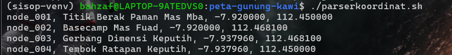

`output posisipusaka.txt`


**KENDALA**

venv sempat masuk di folder repository jadi tree nya berantakan


## SOAL 3

membuat struktur folder yang dibutuhkan beserta file-file pendukungnya, yaitu data/penghuni.csv sebagai database, log/tagihan.log untuk log cron, rekap/laporan_bulanan.txt untuk laporan keuangan, dan sampah/history_hapus.csv untuk arsip penghuni yang dihapus.
```bash
mkdir -p soal_3/data soal_3/log soal_3/rekap soal_3/sampah
touch soal_3/data/penghuni.csv
touch soal_3/log/tagihan.log
touch soal_3/rekap/laporan_bulanan.txt
touch soal_3/sampah/history_hapus.csv
```
Sebelum masuk ke menu, menyiapkan path absolut untuk semua file menggunakan BASH_SOURCE agar script bisa dijalankan dari direktori manapun, termasuk saat dipanggil oleh cron.
```bash
DIR="$(cd "$(dirname "${BASH_SOURCE[0]}")" &> /dev/null && pwd)"

FILE_DATA="$DIR/data/penghuni.csv"
FILE_LOG="$DIR/log/tagihan.log"
FILE_REKAP="$DIR/rekap/laporan_bulanan.txt"
FILE_SAMPAH="$DIR/sampah/history_hapus.csv"
```

`1. Menu Utama`

Menu utama dibuat langsung di dalam while loop utama yang menampilkan ASCII banner dan 7 opsi pilihan. Loop terus berulang sampai user memilih opsi 7 (Exit). Setiap opsi memanggil fungsi masing-masing sesuai pilihannya menggunakan case.
```bash
while true; do
    clear
    echo " /\/\/\/\/\/\/\/\/\/\/\/\/\/\/\/\/\/\/\/\/\/\/\/\/\/\/\ "
    echo "| Kost Slebew ASCII Banner                             |"
    echo " \/\/\/\/\/\/\/\/\/\/\/\/\/\/\/\/\/\/\/\/\/\/\/\/\/\/\/ "
    echo ""
    echo "======================================================="
    echo "             SISTEM MANAJEMEN KOST SLEBEW              "
    echo "======================================================="
    echo "ID | OPTION"
    echo "-------------------------------------------------------"
    echo " 1 | Tambah Penghuni Baru"
    echo " 2 | Hapus Penghuni"
    echo " 3 | Tampilkan Daftar Penghuni"
    echo " 4 | Update Status Penghuni"
    echo " 5 | Cetak Laporan Keuangan"
    echo " 6 | Kelola Cron (Pengingat Tagihan)"
    echo " 7 | Exit Program"
    echo "======================================================="
    read -p "Enter option [1-7]: " pilihan

    case $pilihan in
        1) fungsi_tambah ;;
        2) fungsi_hapus ;;
        3) fungsi_tampil ;;
        4) fungsi_update_status ;;
        5) fungsi_cetak_laporan ;;
        6) fungsi_kelola_cron ;;
        7) echo "Keluar dari program. Terima kasih!"; exit 0 ;;
        *) echo "Opsi tidak valid! Silakan pilih 1-7." ;;
    esac

    read -p "Tekan [ENTER] untuk kembali ke menu..."
done
```

`2. Opsi Tambah Penghuni Baru`

fungsi_tambah() meminta input Nama, Kamar, Harga Sewa, Tanggal Masuk, dan Status Awal. Setiap input divalidasi menggunakan while loop tersendiri sehingga jika input tidak valid, user diminta mengulang input tersebut saja tanpa harus mengulang dari awal. Validasi yang dilakukan: kamar harus unik dicek dengan awk, harga harus angka positif, tanggal harus format YYYY-MM-DD dan tidak boleh masa depan, serta status hanya Aktif atau Menunggak (case-insensitive).
```bash
# Validasi kamar unik
while true; do
    read -p "Masukkan Kamar: " kamar
    cek_kamar=$(awk -F',' -v k="$kamar" '$2 == k {print "ada"}' "$FILE_DATA")
    if [ "$cek_kamar" == "ada" ]; then
        echo "[!] Error: Kamar $kamar sudah terisi! Pilih kamar lain."
    else
        break
    fi
done

# Validasi tanggal tidak masa depan
sekarang=$(date -d "$(date +%Y-%m-%d)" +%s)
while true; do
    read -p "Masukkan Tanggal Masuk (YYYY-MM-DD): " tanggal
    if date -d "$tanggal" >/dev/null 2>&1; then
        format_tgl=$(date -d "$tanggal" +%Y-%m-%d)
        if [ "$tanggal" == "$format_tgl" ]; then
            input_epoch=$(date -d "$tanggal" +%s)
            if [ "$input_epoch" -le "$sekarang" ]; then
                break
            else
                echo "[!] Error: Tanggal tidak boleh melebihi hari ini!"
            fi
        else
            echo "[!] Error: Format tanggal harus persis YYYY-MM-DD!"
        fi
    else
        echo "[!] Error: Format/Tanggal tidak valid!"
    fi
done

# Simpan ke CSV
echo "$nama,$kamar,$harga,$tanggal,$status" >> "$FILE_DATA"
```

`3. Opsi Hapus Penghuni`

fungsi_hapus() meminta input nama penghuni yang akan dihapus. Pencarian nama menggunakan tolower() di awk agar bersifat case-insensitive. Sebelum dihapus, data penghuni dipindahkan ke sampah/history_hapus.csv dengan tambahan kolom tanggal penghapusan. Penghapusan dari database utama menggunakan file temporary agar proses aman.
```bash
baris_data=$(awk -F',' -v n="$nama_hapus" 'tolower($1) == tolower(n) {print $0}' "$FILE_DATA")

# Pindahkan ke history_hapus.csv
echo "${baris_data},${tgl_hapus}" >> "$FILE_SAMPAH"

# Hapus dari penghuni.csv menggunakan file temporary
awk -F',' -v n="$nama_hapus" 'tolower($1) != tolower(n)' "$FILE_DATA" > "${FILE_DATA}.tmp" && mv "${FILE_DATA}.tmp" "$FILE_DATA"
```

`4. Opsi Tampilkan Daftar Penghuni`

fungsi_tampil() menggunakan AWK untuk memformat isi penghuni.csv menjadi tabel rapi. Di dalam AWK dibuat fungsi format_rp() untuk memformat angka harga sewa menjadi format ribuan dengan titik. Di bagian END ditampilkan ringkasan total penghuni, jumlah Aktif, dan jumlah Menunggak.
```bash
awk -F',' '
function format_rp(num) {
    str = num; res = ""; len = length(str)
    for(i=1; i<=len; i++) {
        res = res substr(str, i, 1)
        if ((len-i)%3 == 0 && i != len) res = res "."
    }
    return res
}
BEGIN { count=0; aktif=0; nunggak=0 }
{
    count++
    if (tolower($5) == "aktif") aktif++
    if (tolower($5) == "menunggak") nunggak++
    printf "%-2s | %-10s | %-5s | Rp%-13s | %s\n", count, $1, $2, format_rp($3), $5
}
END {
    printf "Total: %d penghuni | Aktif: %d | Menunggak: %d\n", count, aktif, nunggak
}' "$FILE_DATA"
```

`5. Opsi Update Status Penghuni`
   
fungsi_update_status() meminta input nama dan status baru. Nama dicari secara case-insensitive menggunakan tolower(). Input status juga case-insensitive menggunakan ${status_baru,,} untuk mengubah ke lowercase sebelum dibandingkan, lalu dinormalisasi ke format yang benar. Update dilakukan langsung di CSV menggunakan awk dengan file temporary.
```bash
# Case-insensitive input status
while true; do
    read -p "Masukkan Status Baru (Aktif/Menunggak): " status_baru
    if [[ "${status_baru,,}" == "aktif" ]]; then
        status_baru="Aktif"; break
    elif [[ "${status_baru,,}" == "menunggak" ]]; then
        status_baru="Menunggak"; break
    else
        echo "[!] Error: Status harus 'Aktif' atau 'Menunggak'!"
    fi
done

# Update di CSV
awk -F',' -v n="$nama_update" -v s="$status_baru" \
    'BEGIN {OFS=","} {if(tolower($1) == tolower(n)) $5=s; print $0}' \
    "$FILE_DATA" > "${FILE_DATA}.tmp" && mv "${FILE_DATA}.tmp" "$FILE_DATA"
```

`6. Opsi Cetak Laporan Keuangan`

fungsi_cetak_laporan() menggunakan AWK untuk menghitung total pemasukan dari penghuni Aktif dan total tunggakan dari penghuni Menunggak. Angka diformat menggunakan fungsi format_rp() yang sama seperti di opsi 3. Hasil laporan ditampilkan di terminal sekaligus disimpan ke rekap/laporan_bulanan.txt.
```bash
laporan=$(awk -F',' '
BEGIN { pemasukan=0; tunggakan=0; kamar_terisi=0; daftar_nunggak="" }
{
    kamar_terisi++
    if (tolower($5) == "aktif") { pemasukan += $3 }
    else if (tolower($5) == "menunggak") {
        tunggakan += $3
        daftar_nunggak = daftar_nunggak "    " $1 "\n"
    }
}
END {
    printf "Total pemasukan (Aktif) : Rp%s\n", format_rp(pemasukan)
    printf "Total tunggakan         : Rp%s\n", format_rp(tunggakan)
    printf "Jumlah kamar terisi     : %d\n", kamar_terisi
}' "$FILE_DATA")

echo "$laporan"
echo "$laporan" > "$FILE_REKAP"
```

`7. Opsi Kelola Cron`
   
fungsi_kelola_cron() memiliki sub-menu 4 opsi dengan while loop sendiri agar tidak langsung kembali ke menu utama. Path script disimpan ke variabel SCRIPT_PATH menggunakan $DIR yang sudah diset di awal agar cron bisa menemukan script di path yang benar. Pendaftaran cron baru otomatis menghapus jadwal lama (overwrite) menggunakan grep -v sebelum menambahkan jadwal baru.
```bash
SCRIPT_PATH="$DIR/kost_slebew.sh"
CRON_CMD="$SCRIPT_PATH --check-tagihan"

# Daftarkan cron (overwrite jadwal lama)
crontab -l 2>/dev/null | grep -v "$CRON_CMD" > cron_temp
echo "$menit $jam * * * $CRON_CMD" >> cron_temp
crontab cron_temp
rm cron_temp

# Hapus cron
crontab -l 2>/dev/null | grep -v "$CRON_CMD" > cron_temp
crontab cron_temp
rm cron_temp
```

`8. Pengecekan Tagihan`

Bagian ini dieksekusi ketika script dipanggil oleh cron dengan argumen `--check-tagihan`. Script hanya membaca data penghuni yang berstatus Menunggak menggunakan tolower() agar case-insensitive, lalu mencatat ke log/tagihan.log.
```bash
if [ "$1" == "--check-tagihan" ]; then
    WAKTU_SEKARANG=$(date +"%Y-%m-%d %H:%M:%S")
    awk -F',' -v waktu="$WAKTU_SEKARANG" -v logfile="$FILE_LOG" '
    tolower($5) == "menunggak" {
        printf "[%s] TAGIHAN: %s (Kamar %s) - Menunggak Rp%s\n", waktu, $1, $2, $3 >> logfile
    }' "$FILE_DATA"
    exit 0
fi
```

**OUTPUT SOAL 2**

`menu utama`


`Opsi Tambah Penghuni`

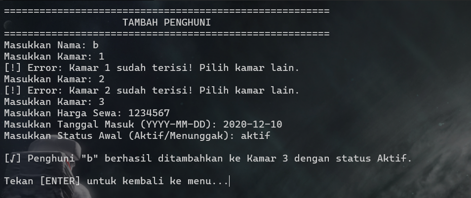

`Opsi Hapus Penghuni`

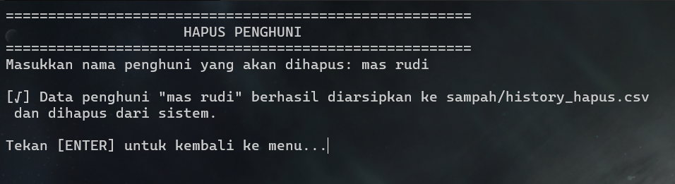

`opsi Tampilkan Daftar`

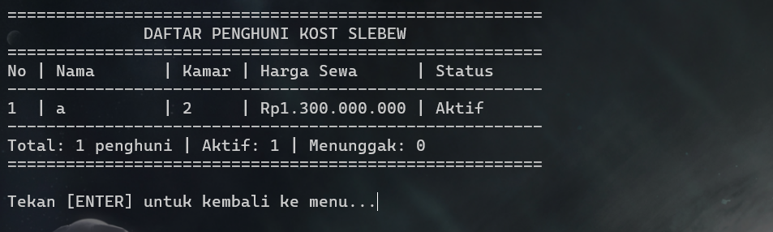

`opsi Update Status`


`opsi Laporan Keuangan`

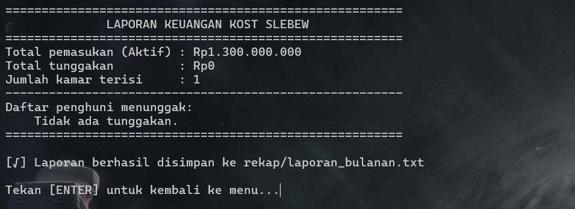

`menu cron`


`daftar cron`

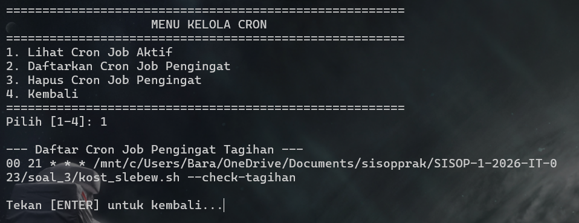

`lihat cron`

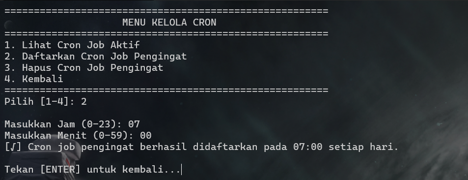

`hapus cron`

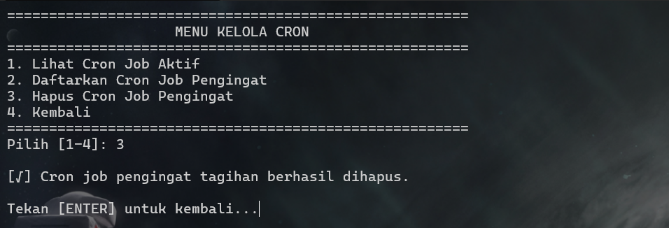

`exit`

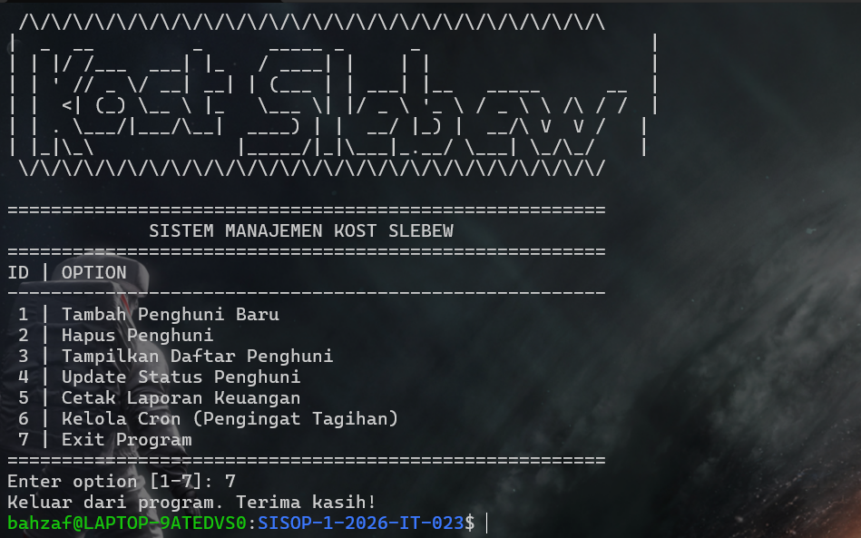

`history hapus`

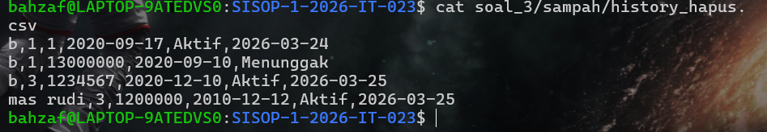

`laporan bulanan`

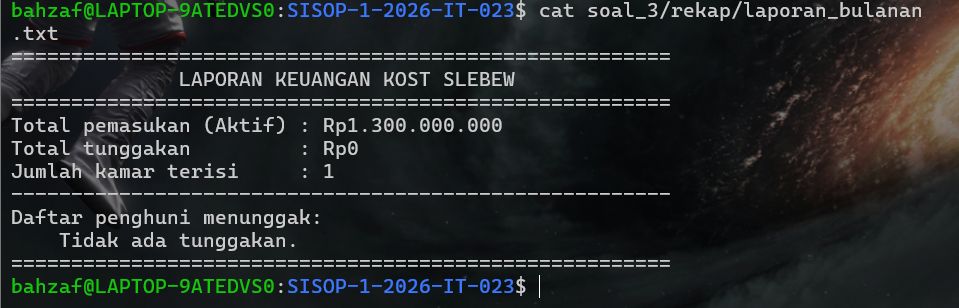

`log tagihan`


**KENDALA**
tidak ada kendala


